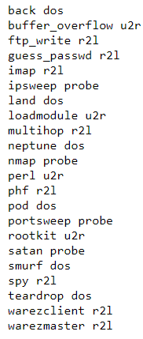

# CMPE 255 Project

We are going to implement a machine learning based intrusion detection system utilizing the dataset from the KDD 1999 Third International Knowledge Discovery and Data Mining Tools Competition. The original task in the competition is to detect whether a connection is an attack or a normal connection. However, we will take this task further and classify the connections into 4 major attacks type and a normal condition.  
- DOS: denial-of-service, e.g. syn flood;  
- R2L: unauthorized access from a remote machine, e.g. guessing password;   
- U2R: unauthorized access to local superuser (root) privileges, e.g., various ``buffer overflow'' attacks;    
- probing: surveillance and other probing, e.g., port scanning.    
- Normal: normal connection  
   
   
Group members:  Yang Chen, Fulbert Jong, David Tang  

Proposed Methodology/Techniques:   
- Nearest Neighbors
   - Using either Cosine Similarity or Euclidean Distance
- Decision Trees
- Neural Networks

Resources and Datasets:    
The Third International Knowledge Discovery and Data Mining Tools Competition (1999)   
http://kdd.ics.uci.edu/databases/kddcup99/kddcup99.html    
The raw training data is about four gigabytes of compressed binary TCP dump data from seven weeks of network traffic. This was processed into about five million connection records. Similarly, the two weeks of test data yielded around two million connection records.     
A connection is a sequence of TCP packets starting and ending at some well defined times, between with data flows to and from a source IP address to a target IP address under some well defined protocol. Each connection is labeled as either normal, or as an attack, with exactly one specific attack type. Each connection record consists of about 100 bytes.  
4898431 samples, 41 attributes   

There are 22 attack type in training sets which will be translated into 4 group of attack types. Here is a list of the attack types:   
   

After translating the labels into our 5 class classifications, we will use classification algorithms to classify each network connection.   

## Environment setup

1.  Install docker-ce
2.  Install docker-compose via `pip install docker-compose`
3.  The dataset used is the KDD Cup 99 dataset http://kdd.ics.uci.edu/databases/kddcup99/kddcup99.html

To download dataset:  
   Download KDD Cup 99 dataset with:

   wget http://kdd.ics.uci.edu/databases/kddcup99/kddcup.data.gz

   or

   wget http://kdd.ics.uci.edu/databases/kddcup99/kddcup.data_10_percent.gz

   and uncompress it. The first one occupies about 740MBytes, the second one
   around 71MBytes. Should you use the smaller dataset, please adjust filename
   in code:
   raw_data_filename = data_dir + "kddcup.data"
   change by
   raw_data_filename = data_dir + "kddcup.data_10_percent"

## Running the project

`docker-compose up --build`  
`python detectAttack.py`

## Errors

1. ERROR: Couldn't connect to Docker daemon - you might need to run `docker-machine start default`.  
`$newgrp docker`
